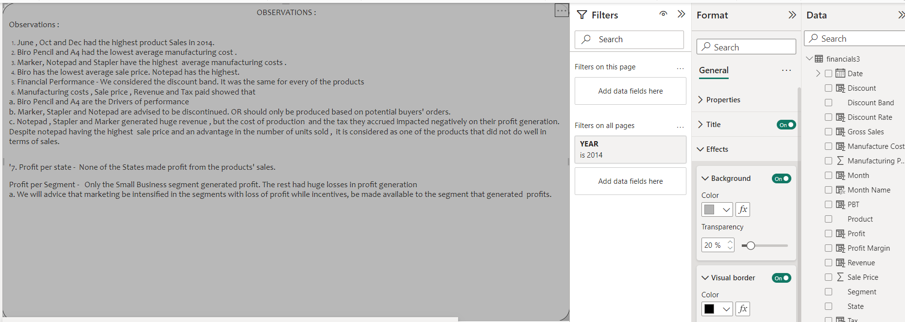
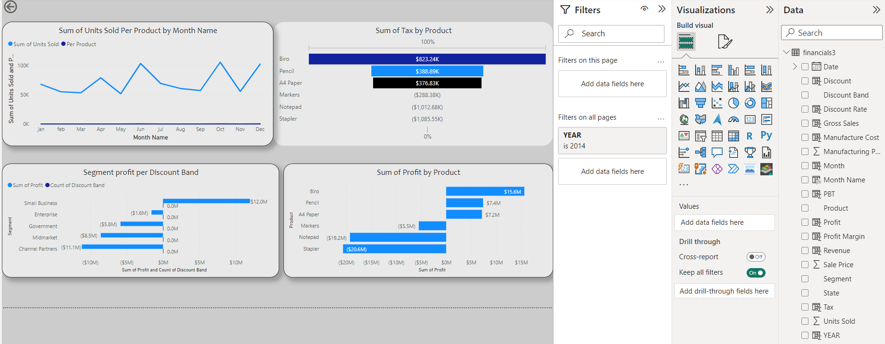
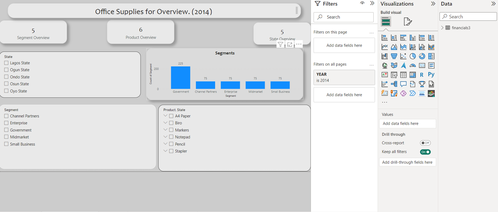
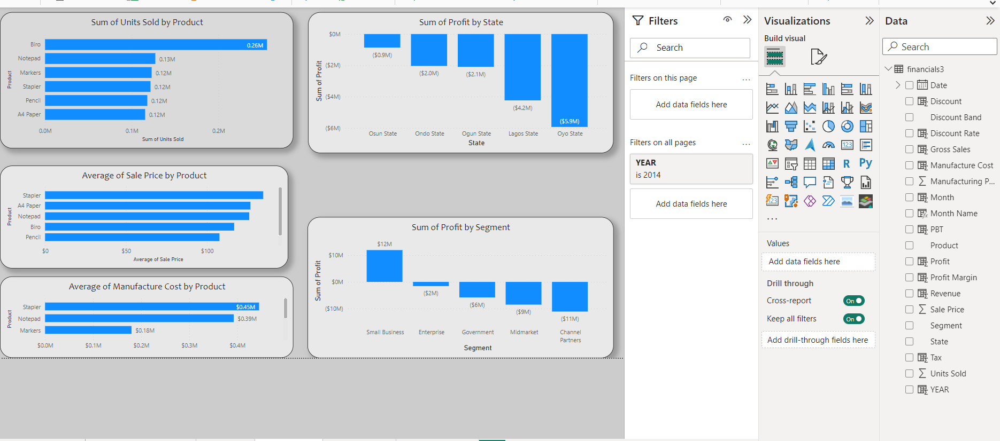
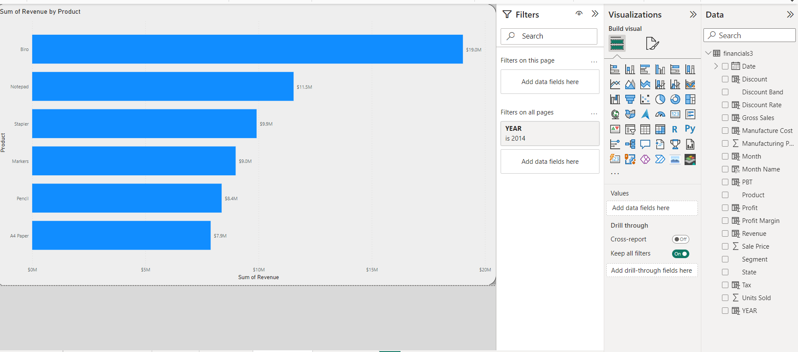

# Office-Supplies-2014-Analysis

# INTRODUCTION
As the fiscal year 2013-2014 commenced, eager investors gathered to witness the unfolding drama in the Stationery Industry. They sought to uncover the manufacturers or segments with the potential for lucrative returns. Join us on this exciting journey through the financial landscape of 2014, where we'll unveil the industry's worth and investment opportunities. The stage is set, and the financial spectacle is about to begin. Enjoy the show!

# PROBLEM STATEMENT
1.Calculate the following, using either Excel or DAX functions: a. Gross Sales b. Discount (use the discount rate) c. Revenue d. Profit before Tax e. Profit Margin f. Tax on Profit (tax rate 5%) g. Profit after Tax
2.Create a report overview for: a. Segment b. State c. Product
3.Produce a report on all products sold between January and December 2014, showing number of sales, sales proportions and financial performance. Ensure your analysis can be used to determine whether there is growth or decline on any of the product lines.
4.What key products are the drivers of performance?
5.If we would like to discontinue any product sub due to poor outcomes, what would this be?
6.What product do we pay the highest tax on?

#CONCEPT USED
Dax formula, Calculated Columns, Data visualization,Story telling.

#DATASET
CSV file titled "Office Supply"

#VISUALS

#FORMULAS
Listed below are some of the Dax formular and calculated columns I wrote.
Gross Sales = [Units Sold]*[Sale Price]
Discount rate=if([DiscountBand]="None",0,if([DiscountBand]="Low",0.01,if([DiscountBand]="Medium",0.05,0.1)))
Discount = [Discount Rate]*[Gross Sales]
Revenue = [Gross Sales]-[Discount]
Manufacture Cost = [Units Sold]*[Manufacturing Price]
Profit before Tax = [Revenue] - [Manufacture Cost]
Tax on profit = 0.05*[Profit before Tax]
Profit after tax = [Profit before Tax]-[Tax on profit]
Month_number = MONTH(financials3[Date])
Year = YEAR(financials3[Date])
Month = FORMAT(financials3[Date],"MMM")

